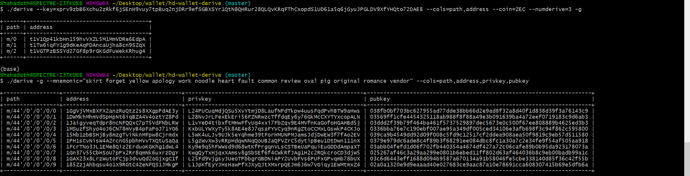
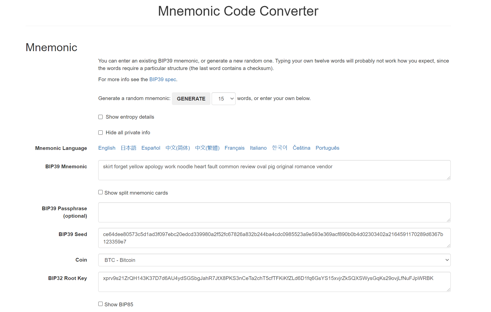
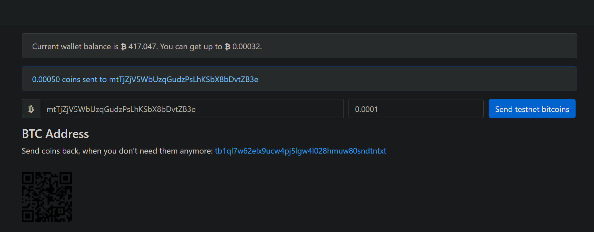
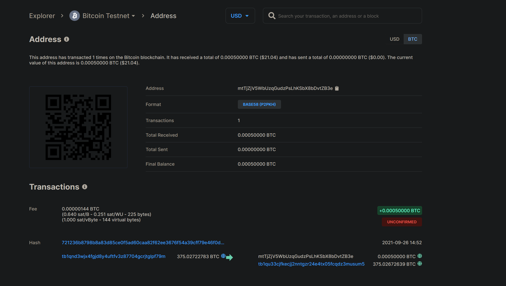
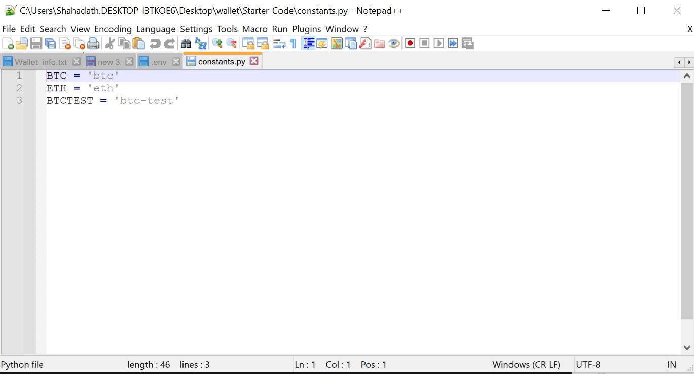
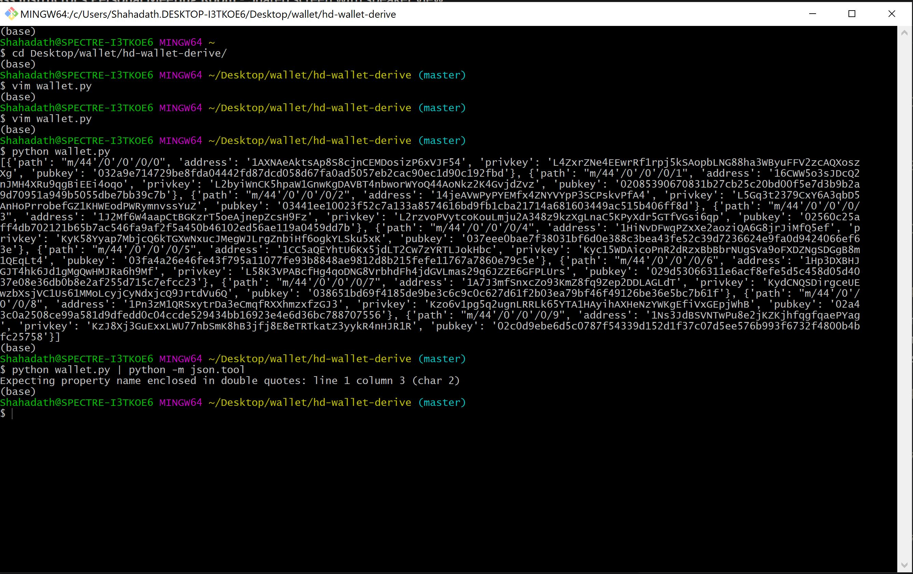
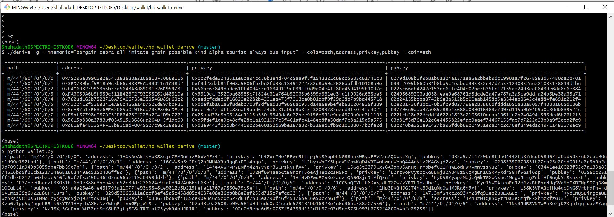
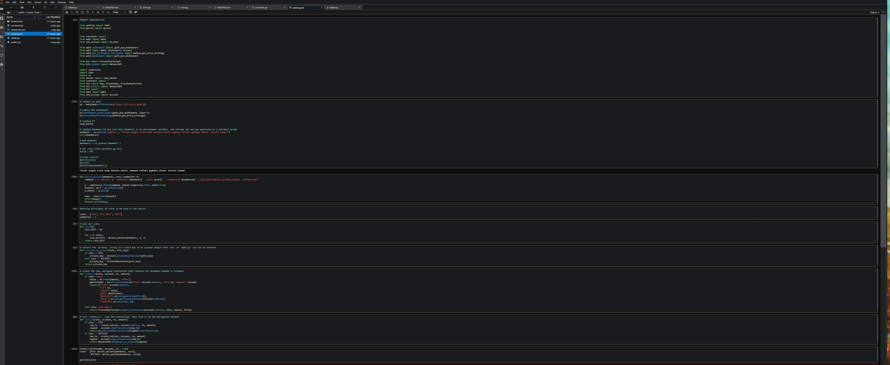

# Multi Blockchain wallet
---
# **Setup**

 1. Derive script appropriately.
## 

2. Generate BIP39 Mnemonic phrase
## 

3. Sending BTC Testnet tokens to wallet address

## 
4. Summary of transaction

## 

5. Constants.py
## 
6. Derive wallet keys 
## 
7. Deriving pyhton.wallet 
## 
8. Python script
## 
